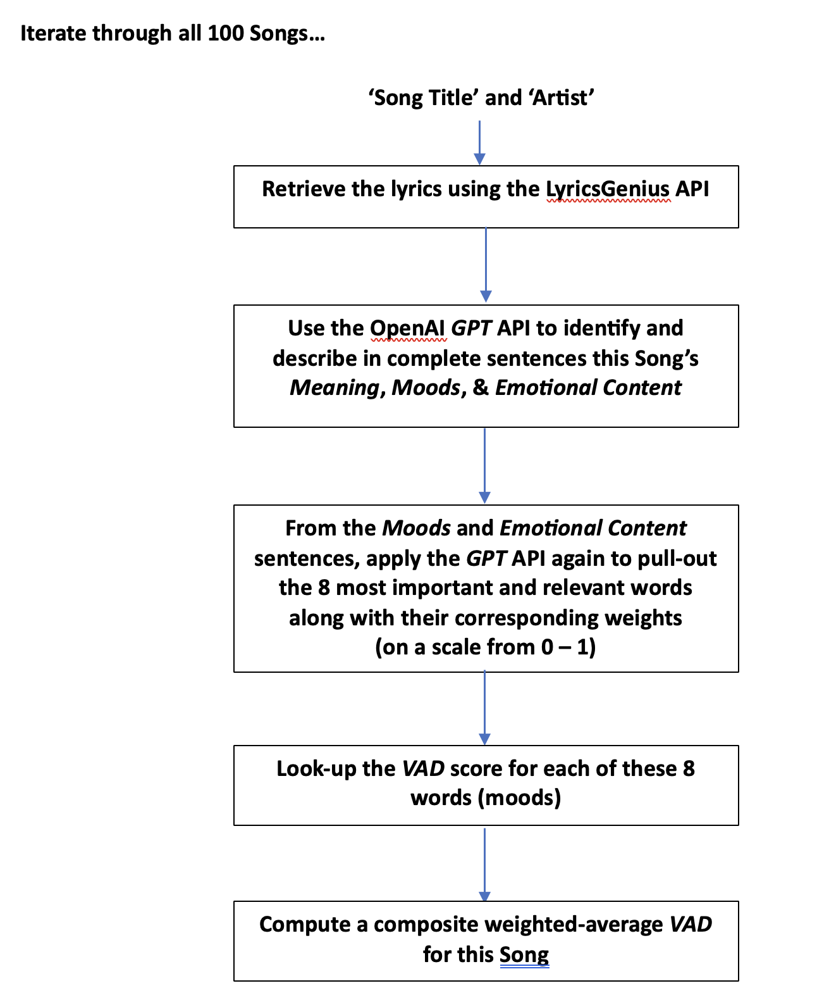

## SongViber

#### An AI-Based Tool Providing In-Depth Insight and Understanding of the Moods and Emotional Content in Songs

*Sanford Baran* - 2023

### 1. Introduction

The ability to comprehend the meaning, moods and emotional content expressed in songs through their lyrics poses many interesting challenges. The process can be quite intricate due to the poetic and metaphorical nature of song lyrics. Additionally, song lyrics often use figurative language, idiomatic expressions and slang which can be challenging to interpret accurately using standard sentiment analysis tools. Also, the overall mood and sentiment in a song can change dramatically from verse to verse, or even line to line.

In this project we investigate whether current breakthroughs in the field of AI, like the OpenAI *GPT* Large Language Model products are up to the task in being able to discern overall what a song is all about and what moods and emotions are being expressed.

In the process of this investigation the *SongViber* python-based tool was developed. Included in this tool are two separate applications, the first of which, a command-line app, uses the OpenAI GPT API to do the language analysis on the lyrics and builds-out the results data into model specific .xlsx files. The second application is the *SongViber* viewer, an interactive web-based app that allows easy inspection of the results data and a provides a means to filter, drill-down and do comparative analysis across the results.

All code and data are publicly available in the *github* repository: <https://github.com/sanfordbaran/songviber>

### **2. Building the data**

**Playlist of Songs Used to Develop the Tool**

To properly develop this tool, it was important to try it out on songs across a reasonably wide range of Genres. Additionally, it was important to pick very recent songs to try to avoid situations where the lyrics might possibly have been part of the training data used in the construction of the OpenAI *GPT* models themselves. The GPT models that are used in *SongViber* are ‘gpt-3.5-turbo’ and ‘gpt-4.’ Training data for the ‘gpt-3.5-turbo’ model goes up through September of 2021. Training data for the ‘gpt-4’ model goes up through April of 2023.

Taking this into account, a playlist from the online music publication *Pitchfork* was selected, its “100 Best Songs of 2023.” (<https://pitchfork.com/features/lists-and-guides/best-songs-2023/>) This playlist consists of songs across 21 different Genres. These Genres are: 'African', 'Alternative', 'Alternative Rap', 'Ambient', 'Americana', 'Dance', 'Electronic', 'Folk', 'Hip-Hop', 'Hip-Hop/Rap', 'Indie Pop', 'Indie Rock', 'K-Pop', 'Latin', 'Metal', 'Musica Mexicana', 'Pop', 'Pop Latino', 'R&B/Soul', 'Singer/Songwriter', and 'Underground Rap.’

**Preparation of the Playlist**

The Pitchfork article had links to this Playlist both for Spotify and Apple Music. For this project the Apple Music Playlist was used: (<https://music.apple.com/us/playlist/the-100-best-songs-of-2023/pl.9ca156e79757405da442f771bdff6358>). Here are the processing steps used to create the initial .xlsx file which would then be fed into the Data Pipeline.

1\. Export ‘The 100 Best Songs of 2023’ Playlist out of Apple Music as a .txt file

2\. Open this .txt file in Excel and save it as a .xlsx file

3\. In this .xlsx remove unnecessary columns, leaving only the columns ‘Name’, ‘Artist’, ‘Composer’, ‘Album’, ‘Genre’, ‘Size’, ‘Time’, and ‘Year’

4\. Change the name of the ‘Name’ column to ‘Title’

5\. Add a ‘Rankings’ column indicating the position of the song in the list (1 – 100). This is easily done as the rows are already properly sorted in ascending order.

6\. Add a ‘Pitchfork_Comments’ column. Cut and paste the comments for each Song in the PitchFork article into this column. The thinking was that this might be a way to compare an actual human reviewer’s impression of a Song against what *SongViber* will be deriving using Large Language Model technology.

Having completed all of the above steps, we end up with the starting data file ‘pitchfork_100_2023.xlsx’, ready to be inserted into the *Data Pipeline*.

**The Data Pipeline**

File ‘pitchfork_100_2023.xlsx’ is then fed into the *SongViber* Data Pipeline to derive ‘Meaning’, ‘Mood’, ‘Emotion’ and VAD information for each song. This is implemented with the following files:

- song_viber_xlsx_builder.py (python file that does all the processing)
- NRC-VAD-Lexicon.txt (list of VAD scores of 19,921 words)
- moods.txt (list of 693 common ‘moods’)
- .env (contains the GeniusAccessToken and the OpenAI API Key)

(Note that if you want to run this in your environment, you will need to edit the ‘.env’ file and fill in your personal GeniusAccessToken and OpenAI API Key)

Basically, the python file ‘song_viber_xlsx_builder.py’ loads ‘pitchfork_100_2023.xlsx’ into a Pandas DataFrame. This DataFrame is iterated-through one row at a time, where each row goes through the following steps:

As each row goes through these steps, various pieces of derived information is written-back to the Panda’s DataFrame, creating new columns along the way. These additional columns are ‘Meaning’, ‘Moods_Description’, ‘Emotions_Descriptions’, ‘Moods’, ‘Moods_JSON’, ‘VAD_Centroid’ and ‘Centroid_Mood.’  

After all 100 rows are processed, the updated Pandas Dataframe is written back out to a new .xlsx file. If a run is done using the ‘gpt-3.5-turbo’ model this output file is named ‘pitchfork_100_2023_gpt35.xlsx’. If the run is done using the ‘gpt-4’ model this output file is named ‘pitchfork_100_2023_gpt4.xlsx’.

### **3. Viewing the data**

Even with only 100 Songs, quite a bit of data is generated. It quickly became apparent that an app would need to be written with a decent GUI, to be able to make sense of all the data and provide some capability to compare results based-on Genre, Moods and the two different LLM models.

**The SongViber Viewer**

This is a python app that uses the handy *Streamlit* framework (<https://streamlit.io>) to fairly easily put an intuitive web-based front-end on the generated *SongViber* data. This application is implemented with these 3 files:

\- song_viber.py

\- pitchfork_100_2023_gpt35.xlsx

\- pitchfork_100_2023_gpt4.xlsx

To run this, you do need to install the **streamlit** package into your python environment:

**pip install streamlit** . You also need to make sure your python environment contains the pandas and numpy packages.

To run the SongViber Viewer from the command line:

**streamlit run song_viber.py**

Another cool aspect of using the *Streamlit* framework is that you can deploy your app for free onto the *Streamlit Community Cloud* server (<https://streamlit.io/cloud>). Taking advantage of this nice free service, the *SongViber* Viewer has been deployed up to the *Streamlit Community Cloud*.

To directly access the *SongViber* Viewer go to this URL:

[https://songviber.streamlit.app](https://songviber.streamlit.app/)

**The SongViber Viewer – How to use**

Bring up the app: [https://songviber.streamlit.app](https://songviber.streamlit.app/)

The app has 2 panes. The sidebar on the left is where all of the filtering controls are. The Data Viewing area is the larger pane on the right.

The Data Viewing area consists of a scrollable Song table at the top that lists all of the songs which satisfy the filtering conditions set in left sidebar. If no Filters are set, the scrollable Song table will display all 100 Songs (from PitchFork’s Best 100 Songs of 2023).

To get the details of a particular song click on the **Row Selector** immediately below the Song Table to choose a particular row. (Unfortunately, the scrollable table in streamlit doesn’t currently support clicking on a row in that Table to make a row selection. This supposedly will be implemented in the 1^(st) Quarter of 2024).

Upon clicking on a Row Selection in the Row Selector control, detailed information about that song appears below the Row Selector control. This detailed Song information includes:

\- Song Name

\- Artist

\- Genre

\- Position in the ‘Top 100’ list

\- Song Lyrics

\- Meaning (generated by OpenAI’s GPT API)

\- Moods Summary (generated by OpenAI’s GPT API)

\- Emotions Description (generated by OpenAI’s GPT API)

\- Moods List (generated by OpenAI’s GPT API)

\- VADS and Relevancy-Weights Table of Each Mood

\- Composite VAD weight average

\- Pitchfork Song Comments

In the left sidebar you can filter the list of songs by Mood, by Genre or by Ranking range.

Selecting a particular **Mood**, filters the Song Table down to only those Songs whose list of Moods contain that selected Mood.

Selecting a particular **Genre** filters the Song Table down to only those Songs of the selected

Genre.

Selecting a **Ranking Range** filters the Song Table down, to either the top 25 Songs, the next lowest ranked 25 (26 – 50), the next lowest ranked 25 after that (51 -75) and finally to the lowest ranked 25 songs (76 – 100).

All 3 Filters work together in parallel, i.e. their ultimate filtering effect is the ‘AND’ing of all 3 of the filters together.

To reset all three Filters to their default state, press the **Reset Filters** button.

One other useful control to mention is the **LLM** control, where you can switch back and forth between results derived from either the ‘gpt-3.5-turbo’ model or the ‘gpt-4’ model. Be aware that switching back and forth between the 2 models will likely affect which rows get displayed in the Song table as well as the detailed Song information fields. Also note that switching back and forth between the models has no effect on the ‘Lyrics’ and ‘Pitchfork Song Commentary’ fields.

### **4. Using OpenAI’s GPT API’s**

**The Art of the ‘Prompt’**

It takes a little bit of doing to get-used-to how to work with Large Language Models like OpenAI’s GPT. The API is implemented using python functions, but within those functions you provide what is called a ‘Prompt’, basically free-form text, where you define what it is you want the model to do. It turns out the process of working with GPT models is often one of trial and error, a process of iterative refinement. Typically prompts need to be adjusted and tweaked to enhance and optimize the quality of outcomes.

One definite rule of thumb, “prompts need to be clear and specific. The more detailed and precise the prompt, the more accurate and relevant the response will be.”

For more detailed guidance on ‘Prompt Engineering’ using the OpenAI APIs see:

<https://platform.openai.com/docs/guides/prompt-engineering>

Here is the ‘Prompt’ that is used in the Data Pipeline described above that derives the ‘Meaning’, ‘Summary of Moods’ and ‘Summary of Emotions’ from a set of Song lyrics.

**Prompt 1:**

You will be provided with song lyrics. The song lyrics will be delimited with "####" characters.

Output the 'Meaning', 'Mood' and 'Emotional Content' of these lyrics in JSON.

Make sure each of these are full sentences.

Here is the ‘Prompt’ that is used in the Data Pipeline described above that takes the “Moods and Emotional Content sentences” (from the output of the previous prompt) and pulls-out the 8 most important and relevant words along with their corresponding weights.

**Prompt 2:**

You will be provided with text delimited with "####" characters.

From this text create a list of the most important words.

Make sure this list is no longer than 8 words.

For each word in this list assign a relevance on a scale of 0.0 - 1.0

Using this list of words and their corresponding relevances, create a list of dictionaries with the keys 'word' and 'relevance'.

Output as JSON

**Functions Using the GPT APIs**

To really get into the details of how this project called and used the GPT APIs, the following functions within the Data Pipeline file (song_viber_xlsx_builder.py) use these APIs either directly or indirectly:

\- get_completion_from_messages()

\- get_completion_and_token_count()

\- analyze_lyrics_using_gpt()

\- get_the_most_relevant_words_and their_relevances()

**OpenAI GPT Models and Pricing**

In this project, two different models were used, ‘GPT-3.5-Turbo’ and ‘GPT-4.0’. In a nutshell the GPT-3.5-turbo model maintains high-quality responses while optimizing for speed and cost-effectiveness. The "Turbo" aspect refers to its enhanced performance in terms of response time. GPT-4 is a more advanced and larger model compared to GPT-3.5. It has a higher capacity for understanding and generating text, which allows it to provide more nuanced and accurate responses. GPT-4 is built upon the learnings from earlier versions, including improvements in language understanding and context handling.

Be aware that using the OpenAI APIs is not free. And it is tempting to want to use the more advanced model GPT-4. But as you might expect, GPT-4 is more expensive to use than GPT-3.5 Turbo. In fact a lot more expensive – by a factor of 10.

Here is the breakdown of GPT API costs accrued developing this project through the months of November and December.

GPT-3.5-turbo \$1.56

GPT-4 \$16.61

### **5. VADs – Describing Moods and Emotions Quantitatively**

While we think we understand what a particular mood or emotion is, these very often are described using words, which can be quite subjective and imprecise. Add to this that one person’s experience of ‘happiness’, for example, can be very different from someone else’s. And this only gets murkier when we try comparing a grouping of multiple moods against another grouping of multiple moods. Or comparing one particular Song characterized by a list of ‘mood’ words against another Song with its own particular list of ‘mood ’words. Are these two songs emotionally similar or not? As you can imagine, not always easy and straight forward to tell.

One approach is to transform a mood *word* or emotion *word* into something more quantitative like a number. To start, you can keep things simple by working in just 1 dimension—for example quantifying how positive or negative you happen to be feeling about the weather today on a scale of let’s say 1 – 10. (one being the most negative and 10 being the most positive).

Turns out there is a much richer more robust quantitative methodology called the **VAD**, a psychological framework used to describe and measure emotional states. It’s comprised of 3 distinct dimensions, **V**alence, **A**rousal and **D**ominance.

The **V**alence dimension measures how positive or negative an emotion is. High valence corresponds to positive emotions like happiness, while low valence is associated with negative emotions such as sadness or anger.

The **A**rousal dimension refers to the level of alertness or activation associated with an emotion. High arousal is linked to emotions like excitement or anger, which are energizing or intense, while low arousal corresponds to states like calmness or boredom.

The **D**ominance dimension assesses the degree of control or powerlessness an individual feels in an emotional state. High dominance is associated with feelings of control or empowerment, while low dominance relates to feelings of being controlled or submissive.

So, the VAD is a 3-dimensional vector, basically 3 numbers. \[Valence, Arousal, Dominance\]. In this project every mood *word* or emotion *word* within a Song is converted to a VAD. And for every Song a composite VAD is computed, by taking the weighted average of the VADs for every mood/emotion that has been identified in the Song.

In the *SongViber* viewer, when looking at the details of a particular song, all of the VADs for each identified mood are displayed in the VADs (Valence, Arousal, Dominance) table. Immediately below that table, the Song’s composite VAD is displayed in the ‘VAD weighted average’ field.

At this stage of the project nothing more has been done with these VAD scores other than to just display them. One avenue of future work is to group Songs with very similar VAD coordinates together—basically identifying Song neighborhoods within the VAD 3-dimensional space. This general approach could prove useful in being able to make Song recommendations more accurately.

### **6. How Well Does this All Work?**

Much more testing still needs to be done to completely evaluate the overall performance of this tool. The best way to do this will be to use the *SongViber* viewer to manually compare how closely the GPT-derived ‘Meaning’, ‘Moods Summary’ and ‘Emotions Description’ fields align with the human generated ‘Pitchfork Song Commentary’ field. This should be done on all of the 100 Songs that have lyrics.

My first impression is that the GPT models at this stage of their development are doing a pretty good job in identifying moods and emotions. They even seem capable of discerning the ‘Meaning’ of a Song at times. That’s because these models have an uncanny ability to deeply *understand* (if that’s the right word for it) how natural languages work.

However there definitely are instances where these models fall embarrassingly short. This occurs when there is no idea who a particular person is or what some other obscure reference refers to. This is to be expected if such knowledge was not available to the models during training.

At some point though, probably in the not-to-distant future, these models will have the ability to go out onto the internet and discover in real time what didn’t get trained into them. It’s inevitable that these AI technologies are only going to get more powerful. Best to become adept at using them while we, the human race, are still in charge.

### **7. References**

Pitchfork – The 100 Best Songs of 2023

<https://pitchfork.com/features/lists-and-guides/best-songs-2023/>

LyricsGenius

<https://lyricsgenius.readthedocs.io/en/master/>

The OpenAI Developer Platform

<https://platform.openai.com/docs/overview>

Streamlit

[https://streamlit.io](https://streamlit.io/)

SongViber Viewer

[https://songviber.streamlit.app](https://songviber.streamlit.app/)

SongViber GitHub Repository

<https://github.com/sanfordbaran/songviber>
